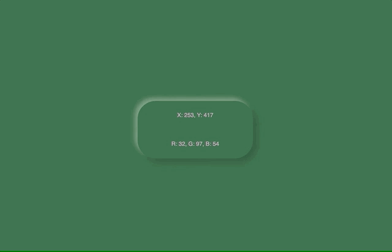

# Color Fun
### Description
Using vanilla JavaScript, changing the color of the background based on the mouse position. 
### Objectives
- try some basic neumorphic design
- change text color depending on the background color
